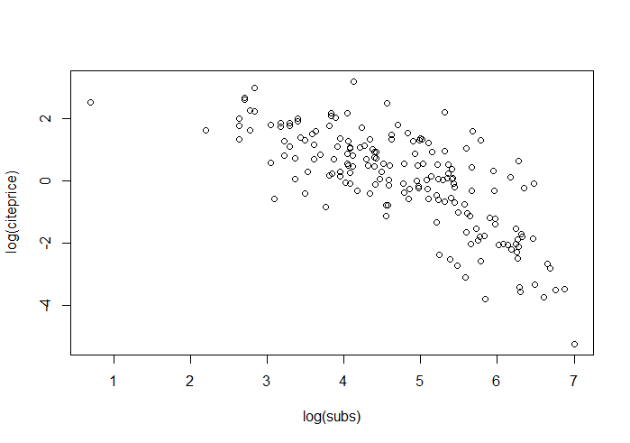
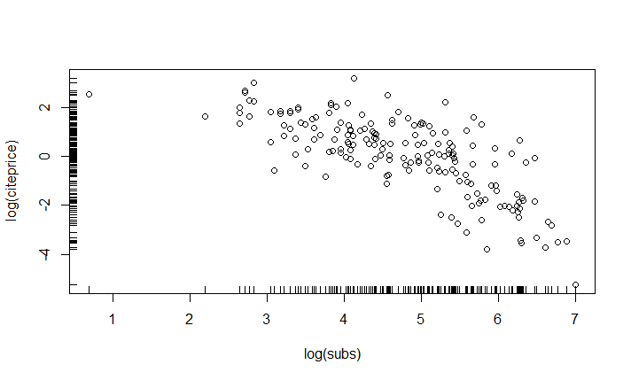
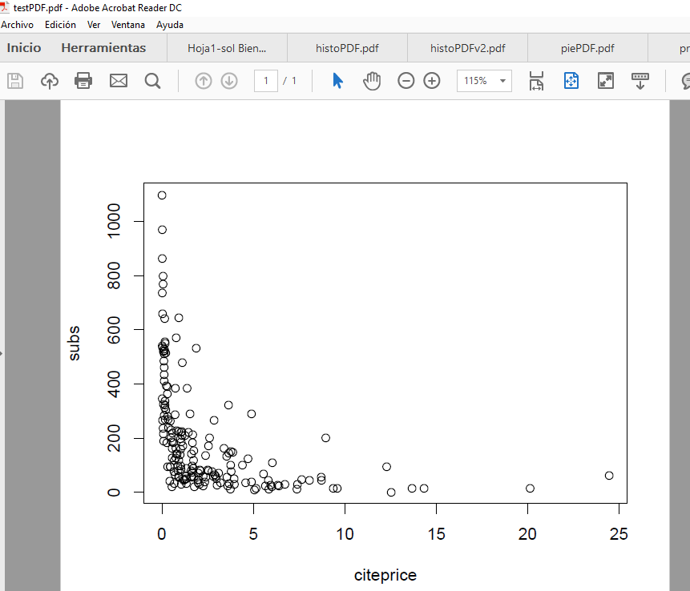
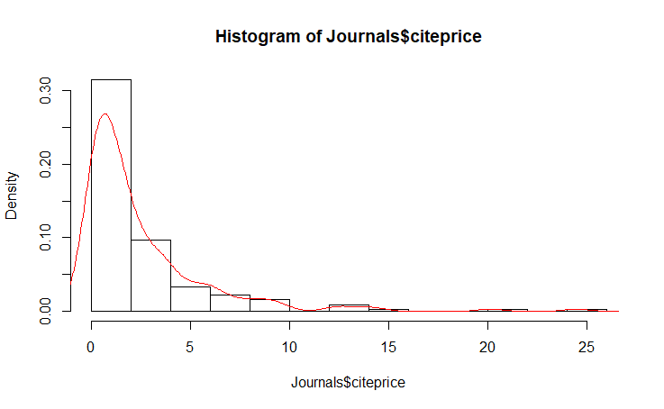
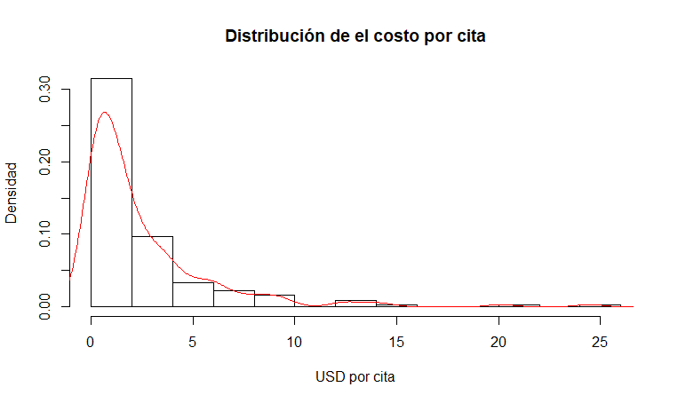
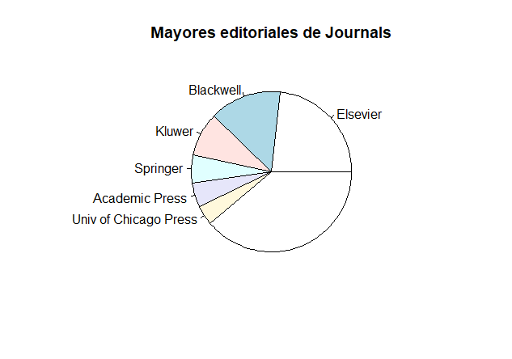
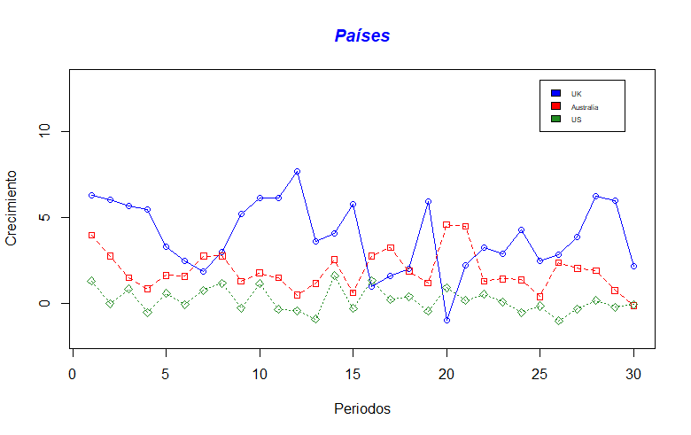

# Tercera sesión de laboratorio en R
    
Este sesión consistió en uso de dataframes y gráficos.

## Uso de dataframes

Primero instalar paquete AER, para poder usar una base de datos preexixtente.

    # Cargamos la librería y la base de datos
    library("AER")

    data("Journals")
    summary(Journals)#Base de datos se comporta como us solo objeto en el global enviroment data frame  
Algunas instrucciones para obtener información de los dataframes:

* ***summary(Nombre de la base)*** Da parametros principales de la base de datos: valores mínimos, máximo,  cuartiles, etc.
* ***head(Nombre de la base)*** Da los primeros 6 renglones de la base de datos
* ***tail(Nombre de la base)*** Da las últimas 6 lineas de la base de datos
* ***Nombre de la base$nombre de variable*** Para llamar a las variables de la base de datos

Ejemplos de código:

    #Instalando los paquetes que usaremos
    install.packages("AER")

    # Cargamos la librería y la base de datos
    library("AER")

    data("Journals")
    summary(Journals)#Base de datos se comporta como us solo objeto en el global enviroment data frame

    JOURNAL = matrix(1:100) #esta es una matriz

    # Head() regresa los primeros elementos de un dataframe #primeros 6 elementos
    head(Journals)

    # Tail regresa los últimos elementos de un dataframe #ultimos 6 elementos
    tail(Journals)

Algunos resultados:

    # Cargamos la librería y la base de datos
    > library("AER")
    > 
    > data("Journals")
    > summary(Journals)#Base de datos se comporta como us solo objeto en el global enviroment data frame
        title                           publisher  society       price       
     Length:180         Elsevier             :42   no :164   Min.   :  20.0  
     Class :character   Blackwell            :26   yes: 16   1st Qu.: 134.5  
     Mode  :character   Kluwer               :16             Median : 282.0  
                        Springer             :10             Mean   : 417.7  
                        Academic Press       : 9             3rd Qu.: 540.8  
                        Univ of Chicago Press: 7             Max.   :2120.0  
                        (Other)              :70                             
         pages            charpp       citations        foundingyear       subs       
     Min.   : 167.0   Min.   :1782   Min.   :  21.00   Min.   :1844   Min.   :   2.0  
     1st Qu.: 548.8   1st Qu.:2715   1st Qu.:  97.75   1st Qu.:1963   1st Qu.:  52.0  
     Median : 693.0   Median :3010   Median : 262.50   Median :1973   Median : 122.5  
     Mean   : 827.7   Mean   :3233   Mean   : 647.06   Mean   :1967   Mean   : 196.9  
     3rd Qu.: 974.2   3rd Qu.:3477   3rd Qu.: 656.00   3rd Qu.:1982   3rd Qu.: 268.2  
     Max.   :2632.0   Max.   :6859   Max.   :8999.00   Max.   :1996   Max.   :1098.0  

                    field   
     General           :40  
     Specialized       :14  
     Public Finance    :12  
     Development       :11  
     Finance           :11  
     Urban and Regional: 8  
     (Other)           :84  
    > 
    > JOURNAL = matrix(1:100) #esta es una matriz
    > 
    > # Head() regresa los primeros elementos de un dataframe #primeros 6 elementos
    > head(Journals)
                                                         title              publisher
    APEL                     Asian-Pacific Economic Literature              Blackwell
    SAJoEH           South African Journal of Economic History So Afr ec history assn
    CE                                 Computational Economics                 Kluwer
    MEPiTE MOCT-MOST Economic Policy in Transitional Economics                 Kluwer
    JoSE                            Journal of Socio-Economics               Elsevier
    LabEc                                     Labour Economics               Elsevier
           society price pages charpp citations foundingyear subs             field
    APEL        no   123   440   3822        21         1986   14           General
    SAJoEH      no    20   309   1782        22         1986   59  Economic History
    CE          no   443   567   2924        22         1987   17       Specialized
    MEPiTE      no   276   520   3234        22         1991    2      Area Studies
    JoSE        no   295   791   3024        24         1972   96 Interdisciplinary
    LabEc       no   344   609   2967        24         1994   15             Labor
    > 

## Trabajando con bases de datos

Se puede modificar una base de datos creando una columna o nueva variable dentro del data frame

*Ejemplo*

    #Creamos una variable que diga el precio por cada cita
      #Crea un avariable dentro de la base de datos , modifica la base de datos
    Journals$citeprice <- Journals$price/Journals$citations

Genera una nueva variable dentro de dataframes

### Bases de datos como parte del ambiente global

La base de datos se puede manejar como parte del ambiente global, y llamar las variables sin necesidad de llamar a sus variables como bases de datos.

* **attach(Nombre de la base)** Para traer la base de datos al ambiente global para poder llamar las variables sin tratamiento especial de base de datos

*Ejemplo*

    #tambien accesa a base de datos
    # attach() permite acceder a los elementos de un dataframe "directamente"
    attach(Journals)

    pages # no se recomienda usar attach, por el nombre de columnas en las bases , quedan en ambiente global

Cuando la base de datos esta dentro del ambiente global, se pueden llamar a las variables/columnas por su nombre sin necesidad de husar el signo $, sin mebargo no es recomendable hacerlo pues se pueden confundir variables con el mismo nombre en el codigo y la base de datos.  

### Separando las bases de datos del ambiente global
* **dettach(Nombre de la base)** Para dejar la base de datos fuera del ambiente global 

*Ejemplo*

    # detach() cierra el "fácil acceso" al dataframe
    detach(Journals)

    pages

Entonces no reconocera a la variable como se muestra enviando mensaje

    > # detach() cierra el "fácil acceso" al dataframe
    > detach(Journals)
    Error in detach(Journals) : invalid 'name' argument
    > 
    > pages
    Error: object 'pages' not found
    > 

## Creando graficos

### Graficos desde global environment 

Se pueden crear graficos con el comando ***plot (x,y)***

    # Scatter plot
    # plot() es la función básica para gráficos en R
    plot(log(subs), log(citeprice))

    #grafico plot (x,y) subscriptores, precio de la cita

Añadir barras para observar la distribución

    # rug() añade barras para indicar sobre los ejes en donde se encuentra una observación
    rug(log(subs))#ver distribución
    rug(log(citeprice), side = 2) #toma eje Y, eso indica el 2

Resultado:

## Crear graficos desde dataframes

Se requiere nombrar la base de datos y el simbolo "~ " para separar x, y

*Ejemplo*

    #aqui se usa plot sin attach, por eso es necesario especificar el dataframe
    # Para plotear lo mismo sin tener que "attachear" el dataframe:
    plot(log(subs) ~ log(citeprice), data = Journals) #simbolo adicional
    plot(log(subs), log(citeprice), data = Journals)# no puede graficar

### Exportar gráfico en formato PDF

Con el sig codigo

    # Veamos la diferencia de plotear en niveles
    plot(subs ~ citeprice, data = Journals)
    # Exportando un gráfico a PDF #recomendado para latex
    #device se abre dispositivo
    pdf("testPDF.pdf", height = 5, width = 6)
    plot(subs ~ citeprice, data = Journals)
    dev.off()
    #cierra dispositivo

Esto permite que el grafico se guarde en formato pdf

### Exportar gráfico en formatos JPG y PNG

Los siguientes codigos permiten exportar los gráficos en JPG y PNG.

*Ejemplo*

**Archivo JPG**

    jpeg(filename = "testJPG.jpg",
         width = 1000, height = 1000, units = "px")
    plot(subs ~ citeprice, data = Journals)
    dev.off()

**Archivo PNG**

    #se recomienda usar PNG

    png(filename = "testPNG.png",
        width = 1000, height = 1000, units = "px")
    plot(subs ~ citeprice, data = Journals)
    dev.off()
    

**Nota:**

Recordemos que ***JPG** no guarda transparencias, hace fondo blanco y formato ***PNG*** guarda transparencias y creado para web

## Generacion de histogramas

### Histogramas de densidad

    # Densidad
    hist(Journals$citeprice, freq = FALSE)
    # Lines es un gráfico de línea, en este caso añade la apariencia de la densidad
    #encima en grafico anterior
    lines(density(Journals$citeprice), col = 1)
    # col indica el color, veamos otros
    lines(density(Journals$citeprice), col = 2) # Rojo

Se puede especificar el color de la línea, con "col="

    

Tambien se pueden personalizar más caracteristicas del gráfico, como título, nombre de ejes, etc.

    # Embelleciendo el histograma
    hist(Journals$citeprice, 
         freq = FALSE,
         border = NULL,
         main = paste("Distribución de el costo por cita"),
         xlab = "USD por cita", 
         ylab = "Densidad")
    lines(density(Journals$citeprice), col = 2) # Rojo

 

Tambien hay gráficos tipo pie, que pueden manipularse para mostrar los datos más representativos de ciertas empresas, y el resto acumularlos en otros.
Se puede lograr con apoyo de la información en el resumen y generando una nueva matriz de resultados.

El comando ***sort*** indica que se acomode la tabla con valores de mayor a menor

    # Resumen de la variable
    summary(Journals$publisher)

    tab <- table(Journals$publisher)
    prop.table(tab) #proporcion de la tabla
    barplot(tab)#grafico de barras
    pie(tab)

    #acomoda datos 
    sortedtab = sort(tab, decreasing = TRUE)#de mayor a menor
    sortedtab#solo hay 6 aplreciables
    otros = sum(sortedtab[7:52])#crea nueva con el resto
    main = sortedtab[1:6]

    Editoriales = append(main,otros)# une los datos de la lista
    Editoriales

    # Eso hace a nuestros plots mucho más entendibles
    barplot(Editoriales) #graficos entendibles
    pie(Editoriales, main="Mayores editoriales de Journals")#pone titulo main

Permite generar la sig imagen

### Más gráficos 

Algunos gráficos se pueden generar a partir de distribuciones muestrales aleatorias.

El sig ejemplo muestra la conformación de una matriz, convertirla en dataframe y asignarle nombres a cada uno de los valores que contiene.

*Ejemplo*

Se genera una muestra de 30 valores, normales aleatorios multivariados

    n = 30 # Tamaño de la muestra
    
    mx = c(4,2,0,0,2) # Vector de medias de X 
    sx = matrix(c(4,-1,0,0,0,
                  -1,1,0,0,0,
                  0,0,1,0,0,
                  0,0,0,9,2,
                  0,0,0,2,4),5) # Varianza de X

    Xsample = mvrnorm(n,mx,sx) # Muestra aleatoria de x1 y x2

Para graficar, se cre vector de apoyo con nombres, se une la matriz horizontal, y se convierte en dataframe

    #creando vector con los nombres de las columnas
    lbls <- c("US", "UK", "Australia", "Germany", "France")#labels

    colnames(Xsample)=lbls#pone nombres a matrix
    Xsample

    index = matrix(1:30) #para nombres en X
    index

    datos = cbind(index,Xsample)#une horizontalmente
    datos

    datosF = as.data.frame(datos) #hacer dataframe
    datosF #coloca nombre a 1era columna hasta hacer dataframe

Ya con los datos preparados se puede definir el gráfico y sus caracteristicas principales

    #graficar
    #matriz de colores
    plot_colors <- c("blue","red","forestgreen")

    # specify them ourself
    plot(datosF$US, type="o", col=plot_colors[1], ylim=c(-2,13), ylab = "Crecimiento", xlab = "Periodos")
    #type = o para lineas, sin type solo scatter

    # Graph trucks with red dashed line and square points
    lines(datosF$UK, type="o", pch=22, lty=2, col=plot_colors[2])

    # Graph suvs with green dotted line and diamond points
    lines(datosF$Australia, type="o", pch=23, lty=3, col=plot_colors[3])
    #pch tipo de simbolo lty tipo de linea 

    # Create a title with a red, bold/italic font
    title(main="Países", col.main="blue", font.main=4)

    legend(25, 13, c("UK","Australia", "US"), c("blue","red","forestgreen"),cex=0.5)

    #legend (X,y,)x donde empiexo en eje X, y donde termino en eje Y, cex proporcion del cuadrito

Tambien se recomienda utilizar otras librerías como **ggplot**
Y consultar tutoriales como  <http://tutorials.iq.harvard.edu/R/Rgraphics/Rgraphics.html>.

